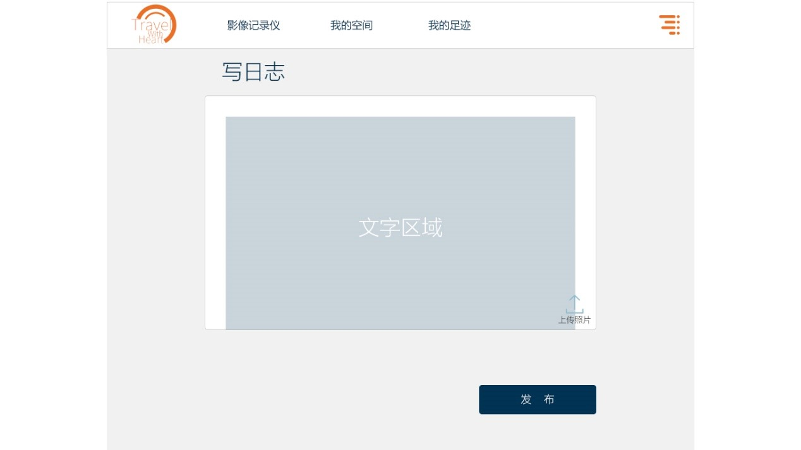
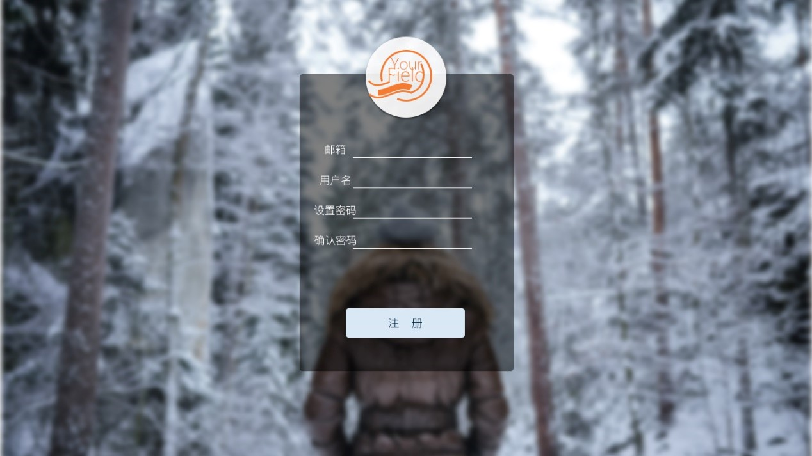

# 零杯参赛作品
这个项目是自己在16年参加的学校的网页设计大赛作品，最后获得了三等奖的成绩。大赛的主题是要求制作旅游网站。这次比赛要求不使用任何现成的框架，因此所有的代码都是原生的。网站较为简单，除登录注册页面是采用php制作外，其他都是静态的代码。下面是作品简介。
!img

## 游方网站功能介绍
游方网站是一个集记录、分享和评论于一身的旅游网站，网站设计之初，我们在调研了当前各大热门旅游网站的基础上，确立自己的独特风格。与其他盈利性旅游网站以游记形式推荐景点、酒店、机票等不同，网站本着“随心”“记录”“分享”的原则，旨在为每个踏上旅途的人提供一份专属的“影像记录仪”，随心而行，随行而写。在这里，我们的每次旅行，都是和世界最美的相遇。  
用户通过登录页面完场注册并登陆，网站主要分为“影像记录仪”“我的空间”“我的足迹”三个部分。  
第一部分：影像记录仪。这部分为用户登录后的主页面，给页面会根据浏览次数和访问次数进行排序，展示用户在平台开放的日志。日志中如果有图片，系统自动抓取日志中的第一张图片在照片墙区域展示。将鼠标放在图片上，日志的概要可显示，点击图片可跳转查看整篇日志。在该页面下方设置了“记录今天”按钮，单击次按钮可以撰写日志。

第二部分：我的空间。这部分是注册用户的个人空间，在这里用户可以查看已经编辑个人资料、上传照片、撰写修改个人日志、查看访客数据、与访客互动等。

第三部分：我的足迹。这部分通过地图定位于好友互动，记录性和趣味性强。打开此页面，网页上方会显示地图，地图右侧显示用户足迹（去过x个地方，上传x照片，写下x故事），在页面下方会根据用户偏好显示相关好友足迹。

除去这三个部分外，网站还附有登录与注册页面。

 
